# LLM Distillation Playbook

**Justin Zhao<sup>&dagger;</sup>, Wael Abid<sup>&dagger;</sup>**

&dagger; Predibase, MLX team

## Table of Contents

- [LLM Distillation Playbook](#llm-distillation-playbook)
  - [Table of Contents](#table-of-contents)
  - [Who is this document for?](#who-is-this-document-for)
  - [Why a distillation playbook?](#why-a-distillation-playbook)
  - [Commmitment to open source](#commmitment-to-open-source)
  - [Key Concepts](#key-concepts)
  - [Best practices](#best-practices)
    - [Understand the limitations of smaller models.](#understand-the-limitations-of-smaller-models)
    - [Build good logging infrastructure to bootstrap datasets with real logs.](#build-good-logging-infrastructure-to-bootstrap-datasets-with-real-logs)
    - [Bootstrap datasets with synthetic data.](#bootstrap-datasets-with-synthetic-data)
    - [Define clear evaluation criteria.](#define-clear-evaluation-criteria)
    - [Maximize the quality of your teacher model.](#maximize-the-quality-of-your-teacher-model)
    - [Maximize the quality of your training data.](#maximize-the-quality-of-your-training-data)
    - [The best datasets are diverse and balanced.](#the-best-datasets-are-diverse-and-balanced)
    - [Start simple and small.](#start-simple-and-small)
    - [Assess the marginal utility of having more data.](#assess-the-marginal-utility-of-having-more-data)
    - [Consider how you want to serve your student.](#consider-how-you-want-to-serve-your-student)
    - [Experiment broadly, one parameter at a time.](#experiment-broadly-one-parameter-at-a-time)
    - [Look at the model's individual mistakes.](#look-at-the-models-individual-mistakes)
    - [Monitor your models in production and A/B test them with real users.](#monitor-your-models-in-production-and-ab-test-them-with-real-users)
      - [Options for model deployment](#options-for-model-deployment)
      - [Infrastructure safeguards](#infrastructure-safeguards)
  - [Contributing](#contributing)

## Who is this document for?

This document is for engineers and ML practitioners interested in **LLM distillation** for production applications. We assume familiarity with language models, deep learning fundamentals, and LLMs. While the advice in this guide is adaptable to other settings like academic research, our focus lies on efficiently building productionizing distilled LLMs.

## Why a distillation playbook?

Almost every organization we’ve worked with has built at least one novel internal application using LLMs; one larger company we spoke to had built 70 prototypes in a week. 

Everyone is building their prototype using large language models, however as large language models (LLMs) become increasingly capable and integral to various applications, the need for their efficient, smaller counterparts has never been more pronounced.

This shift is driven by the compelling performance of LLMs, juxtaposed with the significant costs, resource demands, and slower operational speeds of large models. In response, distilling these models into more efficient, smaller versions presents a solution that balances capability with cost-effectiveness and speed.

Despite significant interest in model distillation, we find there is still an astonshing amount of toil and guesswork involved in actually getting large language models and model distillation to work well in practice. Anecdotes and snippets of advice are spread across arxiv, huggingface, discord, substack, and social media, but the systemization of these recommendations remains to be seen.

The advice in this document draws from our experience distilling language models at Google and Predibase, combined with any LLM research and media we could find on the topic to date. We are hopeful that these strategies for the efficient refinement of LLMs provide practitioners and enthusiasts with ideas that are practical, grounded in academic research, and helpful for the growing development and utilization of open source language models.

## Commmitment to open source

At Predibase, we believe that the future is fine-tuned, specialized, and **open source** LLMs. Open source is in the DNA of the company, and as a company we maintain:

- [Ludwig](https://github.com/ludwig-ai/ludwig): Low-code framework for building custom LLMs, neural networks, and other AI models.
- [LoRAX](https://github.com/predibase/lorax): Multi-LoRA inference server that scales to 1000s of fine-tuned LLMs.

<details><summary><em>[More about Predibase]</em></summary>

Predibase is simply a [managed platform](https://predibase.com) that's built on top of open source. If you are interested in a managed solution for fine-tuning and deploying LLMs, you can sign up for a free trial [here](https://predibase.com).

</details>

## Key Concepts

Before we delve into the best practices for distilling large language models (LLMs), let's define terminology commonly used for model distillation and its applications.

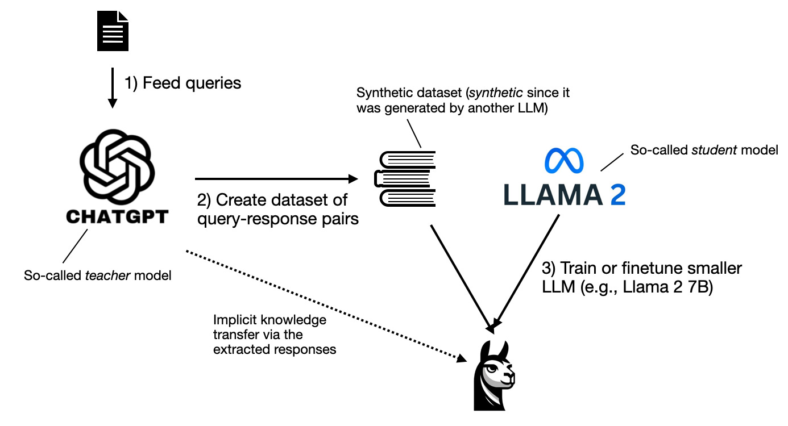

<p align="center" ><i>Illustration of model distillation. <a href=https://magazine.sebastianraschka.com/p/research-papers-in-november-2023>Image source</a>.</i></p>

**Model distillation** enables the refinement and compression of large language models into more manageable, cost-effective versions without significant loss in performance. 

**Large Language Models (LLMs)**: Advanced AI models trained on vast amounts of text data like [ChatGPT](https://chat.openai.com/). They seem to have a deep understanding of language, and can be trained to follow instructions or other tasks involving text.

**Teacher Model**: A capable larger model we aim to transfer to the smaller model.

**Student Model**: The smaller model that the teacher model is distilled into.

## Best practices

### Understand the limitations of smaller models.

***Summary**: Model distillation is an empirical science and is not guaranteed to work well in all cases. The effectiveness of model distillation depends on the task and data.*

There is substantial and growing evidence that smaller models outperform zero-shot and few-shot GPT-4 when fine-tuned on golden labels ([1](https://predibase.com/blog/how-to-fine-tune-llama-70b-for-structured-json-generation-with-ludwig), [2](https://www.anyscale.com/blog/fine-tuning-llms-lora-or-full-parameter-an-in-depth-analysis-with-llama-2)). However, due to their limited size, smaller models might not capture the full depth and nuance of language as effectively as their larger counterparts.

In a canonical model distillation set up where the student model is trained on the raw outputs of the teacher model (also called imitation learning), it's more often the case that the student model will, at best, match the teacher model's quality. 

In [The False Promise of Imitating Proprietary LLMs](https://arxiv.org/abs/2305.15717), researchers found that for certain tasks, smaller student models were only able to successfully mimicked teachers' style while falling short on factual correctness.

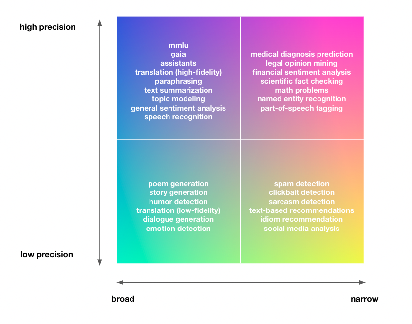
<p align="center" ><i>Spectrum of NLP tasks. The broader the domain and higher required precision, the more difficult the problem, and the less likely distillation will "just work".</i></p>

In truth, the effectiveness of model distillation depends largely on the specific task. Students are likely more disadvantaged than their larger pre-trained teachers when it comes to tasks that require substantial reasoning abilities. Conversely, for tasks that are straightforward and narrowly defined, out-of-the-box imitation learning may be entirely adequate for attaining quality competitive with the teacher model.

<details><summary><em>[Case study: Jigsaw toxic comment classification]</em></summary>

To provide evidence best practices described in this document, we will use the Jigsaw toxicity classification dataset as a testbed.

The [Jigsaw dataset](https://www.kaggle.com/c/jigsaw-toxic-comment-classification-challenge) was created to train models to classify offensive comments. It consists of 160K real comments from the internet and has a mix of offensive and non-offensive examples.

The original dataset contains fine-grained labels for each comment: <code>toxic</code>, <code>severe_toxic</code>, <code>obscene</code>, <code>threat</code>, <code>insult</code>, and <code>identity_hate</code>. We collapse all the columns into one column <code>is_bad</code> to obtain a binary classification dataset.[^1]

[^1]: While there are established state-of-the-art (SOTA) text classification models [specifically designed for the Jigsaw dataset](https://www.kaggle.com/c/jigsaw-toxic-comment-classification-challenge/leaderboard), our intention here is not to surpass these benchmarks. Rather, we utilize this dataset as an illustrative tool to concretely demonstrate and contextualize the best practices of LLM distillation that we will explore in the subsequent sections of this post.

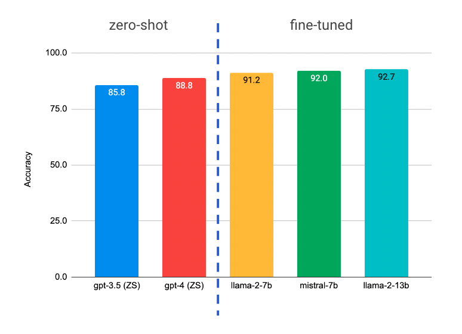
<p align="center" ><i>Model accuracy on a balanced test set comparing zero-shot performance of GPT-* models with OSS LLMs fine-tuned using a random subset of 10K examples.</i></p>

</details>

### Build good logging infrastructure to bootstrap datasets with real logs. 

***Summary**: Have basic logging infrastructure for teacher models in production. If logs are limited due to low traffic, PII, or other constraints, synthetic data generation may be a viable option for dataset bootstrapping.*

Collecting logs from production traffic to your teacher models is a great option for bootstrapping a dataset for distilling fine-tuned models.[^2]

[^2]: Always review the terms of service and usage policies of LLM providers when logging their outputs for distillation. Compliance with these policies is essential. While OpenAI currently does not appear to restrict the use of their models for academic or experimental work, it's advisable to seek clarification for specific use cases.

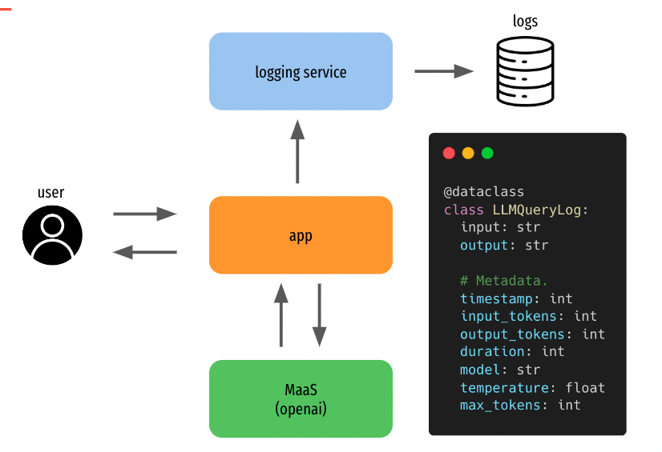
<p align="center" ><i>Example of basic LLM logging infrastructure with a Model-as-a-Service (MaaS) serverless teacher model. Stream requests and responses from your MaaS endpoint to a storage solution like Amazon S3 or a Snowflake table.</i></p>

### Bootstrap datasets with synthetic data.

For applications with limited data either due to low traffic, PII, or other constraints, **synthetic data generation** may be a viable option for fine-tuning data.

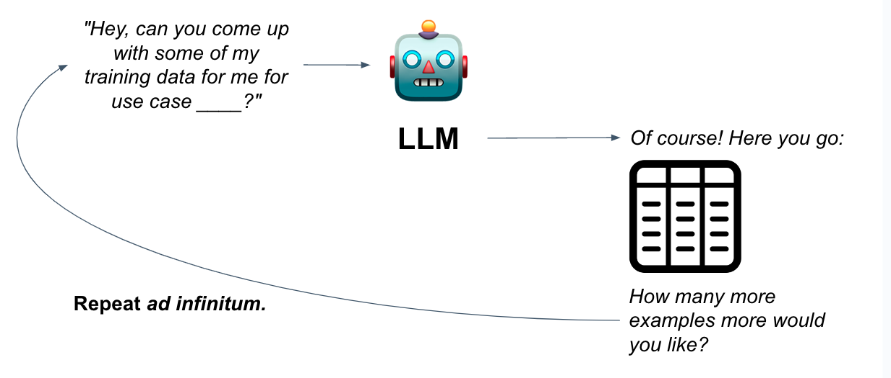
<p align="center" ><i>Bootstrap your dataset with synthetic data. The biggest challenge with synthetic data is to ensure that the examples produced are varied and non-repetitive.</i></p>

Papers like [Self-Instruct](https://arxiv.org/abs/2212.10560), [Alpacare](https://arxiv.org/pdf/2310.14558.pdf) or Microsoft's [phi-1](https://arxiv.org/pdf/2306.11644.pdf)/[phi-1.5](https://arxiv.org/pdf/2309.05463.pdf)/[phi-2](https://www.microsoft.com/en-us/research/blog/phi-2-the-surprising-power-of-small-language-models/) show how synthetic datasets, generated through creative variations of seed queries to GPT models, can be used to fine-tune compelling smaller models.

> "We speculate that the creation of synthetic datasets will become, in the near future, an important technical skill and a central topic of research in AI." ~ [phi 1.5 technical report](https://arxiv.org/pdf/2309.05463.pdf)

### Define clear evaluation criteria.

***Summary:** Effective evaluation of distilled models requires clearly defined criteria that align with your specific application's needs. The choice of evaluation metrics should reflect the nature of the problem and the desired outcomes of the model.*

This is a well-known best practice for machine learning, but it's worth reiterating because it's so important.

**Tailoring evaluation to the application**: Effective evaluation of distilled models (or any model) requires clearly defined criteria that align with your specific application's needs. For instance, LLMs for JSON generation tasks might focus on checking for schema adherence, extraction tasks might focus on accuracy or recall, and other language generation tasks might use BLEURT, ROUGE, or perplexity. The key is to select metrics that best represent the success of the model in its intended environment.

**The emergence of LLMs as judges**: There's a growing trend of using LLMs themselves to assess model outputs, especially in scenarios where traditional metrics might fall short or where manual evaluation by human raters is too expensive. This approach can be compelling but requires [careful consideration](https://arxiv.org/abs/2306.05685) to account for LLM biases.

**Consistency and diversity in test sets**: Establishing clear test sets is critical. These sets should be diverse enough to cover various aspects of model performance yet consistent enough to allow for reliable tracking over time. Avoid changing your test sets frequently, as consistency is key to comparing performance across different models and iterations.

<details><summary><em>[Case study: Jigsaw toxic comment classification]</em></summary>

The original [Jigsaw dataset](https://www.kaggle.com/c/jigsaw-toxic-comment-classification-challenge) contains fine-grained labels for each comment: <code>toxic</code>, <code>severe_toxic</code>, <code>obscene</code>, <code>threat</code>, <code>insult</code>, and <code>identity_hate</code>. We collapse all the columns into one column <code>is_bad</code> to obtain a binary classification dataset.

Sampling a test set randomly from this data gives us a dataset with the distribution of: 90% non-toxic, 10% toxic.

While this distribution matches what we expect our application to receive (mostly non-toxic comments), we want to be sure that any model we put in production is equally good at detecting both offensive and non-offensive comments.

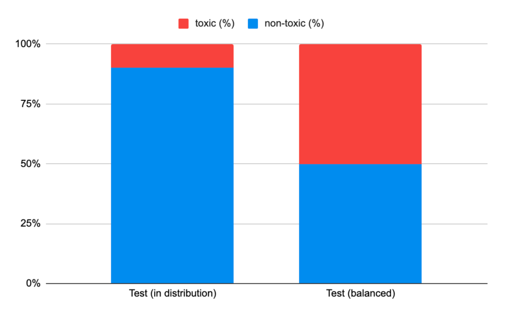

For this use case, let's formalize 2 different test sets:
1. An in-distribution test set with 90% non-bad examples and 10% toxic examples, drawn from the original test set.
2. An explicitly balanced test set with 50% non-toxic and 50% toxic examples, drawn from the original test set.

By measuring models on both of these test sets simultaneously, we can observe how well a candidate model classifies toxic comments classification overall, as well as how well these classifications would fare in a traffic-realisitic setting.

</details>

### Maximize the quality of your teacher model.

***Summary:** The quality of your teacher model's outputs serves as an upper limit for the performance of your distilled student model. Invest in maximizing the quality of your teacher model's performance as much as possible.*


<p align="center" ><i>Garbage in, garbage out. Make your teacher model as good as it can be before feeding its outputs for the student to imitate.</i></p>

**Choose a good teacher:** The choice of the teacher model is a critical first step. Opt for a model that demonstrates the highest accuracy and understanding of your task. GPT-4 is generally great, but maybe there's a better foundation model out there for your use case, which may be better specialized on data similar to your task.

| Metric          | zephyr-7b-alpha | Mixtral-8x7B-Instruct-v0.1 | Llama-2-70b-hf | Yi-34B-200K | CodeLlama-34b-Instruct-hf | GPT-3.5 | GPT-4 | Gemini     |
| --------------- | :-------------: | :------------------------: | -------------- | ----------- | ------------------------- | ------- | ----- | ---------- |
| Overall average |      59.5       |            72.6            | 67.9           | 70.8        | 57.3                      | 70.9    | 88.3  | 90.7       |
| ARC             |      61.0       |            70.2            | 67.3           | 65.4        | 54.3                      | 82.9    | 94.9  | unreported |
| HellaSwag       |      84.0       |            87.6            | 87.3           | 85.6        | 76.9                      | 79.4    | 92.4  | 87.8       |
| MMLU            |      61.4       |            71.2            | 69.8           | 76.1        | 55.5                      | 67.4    | 83.7  | 90.0       |
| TruthfulQA      |      57.9       |            64.6            | 44.9           | 53.6        | 44.4                      | 61.4    | 79.7  | unreported |
| Winogrande      |      78.6       |            81.4            | 83.7           | 82.6        | 74.6                      | 65.8    | 87.1  | unreported |
| GSM8K           |      14.0       |            60.7            | 54.1           | 61.6        | 38.0                      | 68.2    | 92.1  | 94.4       |

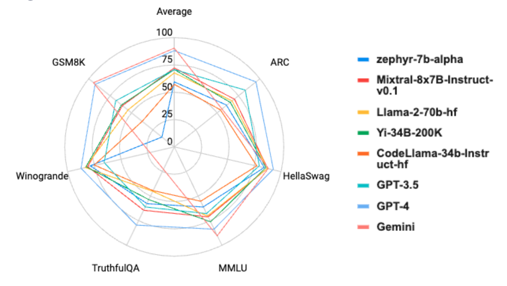
<p align="center" ><i>Sources: <a href="https://huggingface.co/spaces/HuggingFaceH4/open_llm_leaderboard">Open LLM Leaderboard</a>, <a href="https://the-decoder.com/gpt-4-crushes-other-llms-according-to-new-benchmark-suite/">GPT-4 "crushes" other LLMs according to new benchmark suite</a>, <a href="https://storage.googleapis.com/deepmind-media/gemini/gemini_1_report.pdf">Gemini: A Family of Highly Capable Multimodal Models</a></i></p>

**Choose a good prompt:** Iterating on your prompts and prompt parameters can significantly enhance the quality of the teacher model's outputs. Thoughtfully crafted prompts often lead to more accurate and contextually relevant responses, which in turn, provide better training material for the student model. 

<details><summary><em>[Case study: Jigsaw toxic comment classification]</em></summary>

Varying the LLMs, prompts, and temperature, has a significant effect on the consistency of the label relative to human toxicity labels.

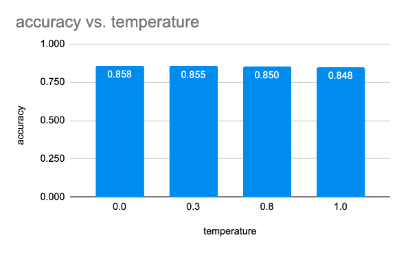

The best temperature for this dataset appears to be 0.0. A higher temperature boosts the creativity of the outputs of the LLM, which likely isn't useful in a binary classification setting.

We highlight accuracy on `test-balanced` with two different prompts:

Simple prompt:
```
Given the input text below, please classify whether it is toxic. Provide your classification in a JSON format with the key 'is_bad'. If the comment is indeed toxic, set is_bad=1, otherwise set is_bad=0.

Input text: '%s'

Output:
```

Chain-of-Thought prompt:
```
For a well-intentioned content moderation app, we want to flag a comment if it may contain toxic, insulting, obscene, or threatening language. Given the input text, please classify its toxicity. Please format your response in the form of a python dictionary with the following keys:

1. 'is_bad': If the comment is indeed toxic, use set is_bad=1, otherwise set is_bad=0.
2. 'reason': Provide an appropriate amount of detail for for your judgment.

Think step by step.

Input text: '%s'
Output:
```

Here were our results:

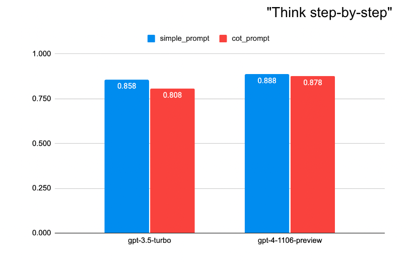

A more sophisticated prompt does not always lead to better quality. The `simple_prompt` seems to be more aligned with human labels than a more sophisticated `Chain-of-Thought` prompt. The gap is smaller when using GPT-4. Perhaps the additional reasoning that is spurred by Chain-of-Thought prompting increases the rate of false positives.

</details>

### Maximize the quality of your training data.

***Summary:** If you can continue enhancing the quality of your training data, with or without involvement from teachers, you absolutely should. Consider how you might fundamentally improve the quality of your data with manual curation, rules-based filtering, scoring example quality, or teacher aggregation.*

Most mistakes made by converged student models can be traced back to issues with the source data. For student models, addressing data quality issues at the source is typically more efficient than trying to correct these issues with auxiliary systems.

Here are some of the most popular techniques.

| Technique                                        | Difficulty | General applicability | Manual labor | Description                                                                                                                                                                                                                                             |
| ------------------------------------------------ | ---------- | --------------------- | ------------ | ------------------------------------------------------------------------------------------------------------------------------------------------------------------------------------------------------------------------------------------------------- |
| Manually fix or curate your data.                | ★          | ★★★★★                 | ★★★★★        | Manually fix and revise bad outputs. Annotate new data. Simple but labor-intensive, this method ensures high-quality, error-free training material.                                                                                                     |
| Filter data based on rules.                      | ★★         | ★★★★                  | ★★★          | Employ basic rules (length criteria, regex patterns) to eliminate poor-quality data. While setting up rules is straightforward, identifying the right criteria can be time-consuming.                                                                   |
| Rank your data with auxiliary systems (or LLMs). | ★★★        | ★★★                   | ★            | Use an auxiliary system, such as another model, to assess and rank data quality. For example, Microsoft's phi-1 model employs GPT-4 to score training examples, using a classifier to prioritize higher-value data, and drop the bottom X% of examples. |
| Enrich data with explanation traces.             | ★★★        | ★★                    | ★            | Collect reasoning data. If your task requires non-trivial reasoning, you may find similar performance gains from including explanation traces or chain-of-thought (CoT) outputs from the teacher.                                                       |
| Aggregate your teachers.                         | ★★★★       | ★                     | ★            | For recursively-definable tasks such as summarization, use chaining. For tasks with exact answers, take a majority vote. By consolidating multiple teachers, you enable your student model to leapfrog any single teacher.                              |

<details><summary><em>[Case study: Jigsaw comment toxicity data quality experiments]</em></summary>

To assess the impact of data quality on model performance, we can derive 6 subsets of training data from the Jigsaw dataset, and train models for each of them.

- A (1.1k rows): in-distribution, GPT labels.
- B (2.2k rows): A + 1.1k rows in-distribution Gold labels.
- C (2.1k rows): B filtered to remove GPT errors.
- D (3.2k rows): B + 1k rows with Gold toxic labels.
- E (5k rows): Larger in-distribution dataset, GPT labels.
- F (10k rows): Largest in-distribution dataset, GPT labels.

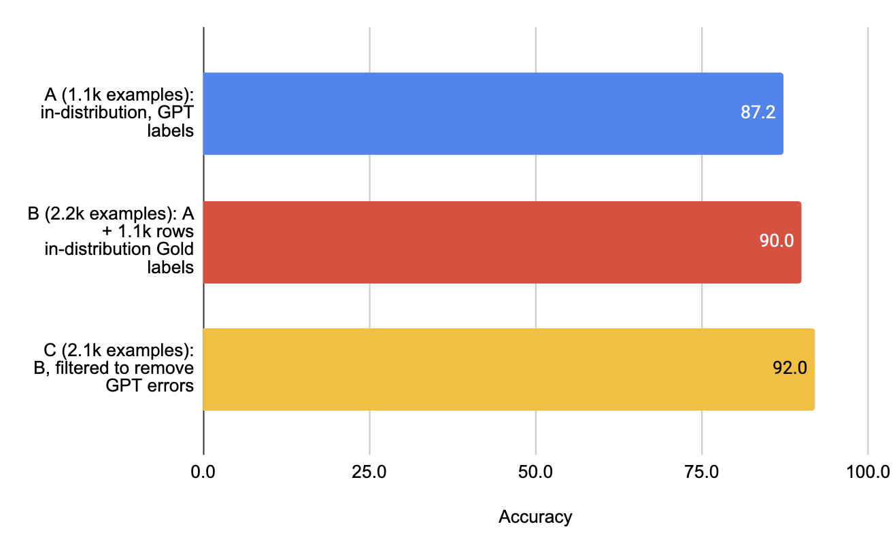
<p align="center"><i>Model performance on a balanced test set.</i></p>

Performance improves both when high-quality human-labeled examples are added as well as when incorrect teacher-labeled examples are removed.

</details>

### The best datasets are diverse and balanced.

***Summary:** Try to make your dataset diverse, non-repetitive, and balanced. The more scenarios and complexities your dataset covers, the more likely the distilled student will generalize in an unbiased way.*

One of the main challenges in creating a high-quality dataset is ensuring that the examples are varied and non-repetitive. The training data for your student model should cover a wide range of scenarios, and they should vary in their level of difficulty, complexity, and style.

**Diversity** is important for several reasons: it exposes the language model to different cases that it needs to be able to handle, it reduces the risk of overfitting or memorizing specific patterns or solutions, and it increases the generalization and robustness of the model to unseen or novel situations.

**Balance** is just as important. If certain cases are sparsely represented in the overall dataset, it may be challenging for your student model to learn these.


<p align="center"><i>Datasets bootstrapped from real logs can also be variation and balance-deficient. Make sure that certain power users aren't overrepresented in your dataset. Debias logs with random mutation, send rare cases through paraphrasing or back-translation as a data augmentation step, or manually add missing cases.</i></p>

It's not essential to know or address all data distribution issues upfront, but it's useful to anticipate them. Trust that if you've picked good test sets, meaningful biases in student models should become apparent during evaluation, and these can often be addressed with adjustments to training data.

<details><summary><em>[Case study: Jigsaw toxic comment classification]</em></summary>


<p align="center"><i>Model performance on a balanced test set.</i></p>

Perfectly balanced is not necessary, nor necessarily better.

For example, it could be that the non-toxic examples are more difficult to detect than the toxic ones, so the model may very well benefit from having more examples of the more difficult class while having fewer examples of the easier classes.

In general, it’s hard to know what the best "balance" is upfront, or, for non-classification tasks, how to balance the dataset in the first place.

The higher-level idea is that if you have good test set(s), then when you do model evaluation with (unintentionally) imbalanced training data, you’ll be able to spot bias patterns that clue you into dataset distribution adjustments.

</details>

### Start simple and small.

***Summary**: Start with smaller, simpler model configurations that are quick to train so that you can debug issues with your setup, iterate quickly, and establish good benchmarks for comparing to more complex model configurations later.*

**Embrace the power of the smallest model.** Not just a matter of efficiency; it's a strategic approach to model development. Smaller, simpler models are significantly quicker to train and understand, allowing for the fastest iteration and feedback.

**Avoid the trap of cool, but complicated large models.**  One of the most common pitfalls in model training is starting with too large and too complex model configurations. These will be harder to understand, slow down iteration velocity, and extend experiment cycle times.

**The value of naive baselines.** Always begin with naive, simple baseline models. These serve as a clear benchmark to measure the performance of latent more sophisticated model configurations.

### Assess the marginal utility of having more data.

***Summary:** As a rule of thumb, meaningful fine-tuning results are often achieved with datasets ranging from a few hundred to tens of thousands of examples. To answer the question more concretely, run an ablation of varying dataset size and extrapolate.*

> *"How much data do I need for fine-tuning my model?"* 
> 
> ~One of the most common questions that we get asked.

In earnest, it really depends, influenced by factors such as task difficulty, output variability, reasoning complexity, example length, task alignment with pre-training data, and hyperparameters. Some problems require minimal data for convergence, while others demand extensive training without converging at all.

To determine a good dataset size for your specific case, conduct an ablation experiment holding other training parameters constant, and varying dataset size (e.g., 5%, 10%, 25%, 50%, 75%, 100%).

Such experiments can reveal the marginal utility of having additional data for fine-tuning. If increasing data quantity doesn't yield much improvement, it's advisable to reevaluate other aspects of the training pipeline to identify potential areas for enhancement.

If you do find that the marginal utility of having more data is high, then consider text data augmentation techniques like [back translation](https://github.com/QData/TextAttack), or getting more data synthetically or manually.

<details><summary><em>[Case study: Jigsaw toxic comment classification]</em></summary>

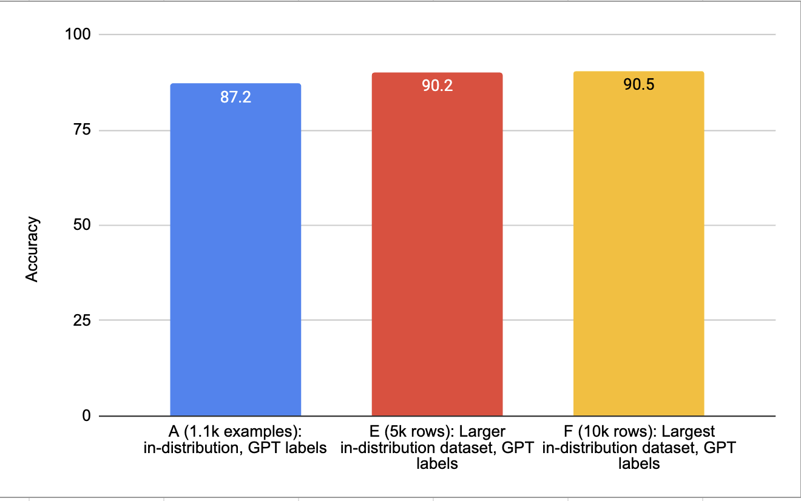
<p align="center"><i>Model performance on a balanced test set.</i></p>

While there's a big jump in performance from 1.1K examples to 5K examples, the jump in quality from 5K to 10K is rather marginal. Based on these scores, we can roughly extrapolate that there is diminishing marginal utility for adding more training data for this model configuration beyond 10K examples.

</details>

### Consider how you want to serve your student.

***Summary:** While not crucial to decide upfront, have a model serving plan in mind to prioritize experiments with models that can ultimately be served.*

If you are planning to deploy multiple LLMs in production, it's beneficial to explore parameter-efficient fine-tuning (PEFT) techniques. PEFT, such as LoRA (Low-Rank Adaptation), involves training only a fraction of the model's weights, unlike full fine-tuning, which requires a dedicated set of GPU resources for each model. LoRA has been shown to [achieve performance on par with full fine-tuning](https://arxiv.org/abs/2106.09685), making it a viable option for efficient deployment.

[The LoRA Exchange (LoRAX)](https://github.com/predibase/lorax), for example, is a serving solution optimized for serving numerous fine-tuned models using shared GPU resources. LoRAX stands out from traditional large language model serving methods by its ability to accommodate over a hundred task-specific, fine-tuned models on a single GPU. This capability significantly reduces the cost and complexity of serving fine-tuned models. LoRaX is especially suited for parameter-efficient fine-tuned models, offering a streamlined solution for deployment.

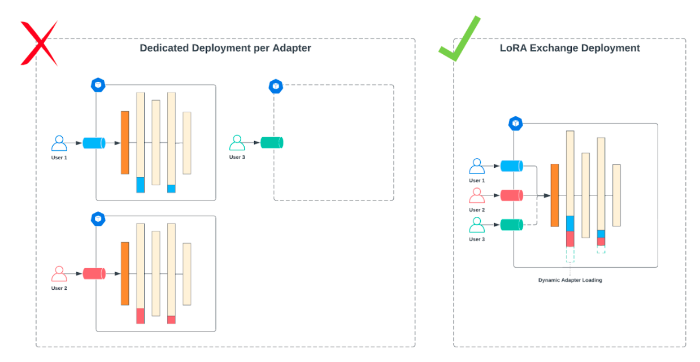
<p align="center" ><i>Serving adapter-based LLMs with LoRAX.</i></p>

It's important to consider the serving architecture early in the model development process. The type of model you choose can greatly influence how it will be served, its performance in production, and prioritizing experiments.

While full fine-tuning with larger models might yield the highest absolute quality, the trade-off in terms of increased costs or serving latency might not justify the marginal gains in performance.

### Experiment broadly, one parameter at a time.

***Summary:** Exploration over exploitation: spend most of your time and energy to gain insight into the problem. Change one variable at a time, and try not to rathole.*

Tips for running lots of experiments at once:
- Stay organized with model repositories or spreadsheets.
- Parallelize but only change one parameter at a time.
- Expect some toil and guesswork.
- Optimize for iteration speed (simple -> complex, small -> large)

The following suggestions came about as we tried to crystalize our own approach to fine-tuning LLMs. This is far from a comprehensive list, but here are some of our favorites.

| Category               | Idea                                | Impact to Quality | Impact to Speed | Complexity | Description                                                                                                                                                                                                                                                                                                                                                                                                                                                                                                                                                             |
| ---------------------- | ----------------------------------- | ----------------- | --------------- | ---------- | ----------------------------------------------------------------------------------------------------------------------------------------------------------------------------------------------------------------------------------------------------------------------------------------------------------------------------------------------------------------------------------------------------------------------------------------------------------------------------------------------------------------------------------------------------------------------- |
| Architecture parameter | Foundation model                    | ★★★★★             | ★★              | ★          | Try out a few different foundation models and see what happens to your student models performance. Like teachers, different foundation models may be inherently closer to your task than others.                                                                                                                                                                                                                                                                                                                                                                        |
| Architecture parameter | Precision and quantization          | ★★★★              | ★★★★            | ★★         | Reducing precision significantly decreases the model's size, enabling it to train with larger batch sizes and thus higher throughput. While quantization can sometimes lead to a slight decrease in model accuracy due to the reduced precision, it's not always the case. In our experiments, oftentimes the trade-off is minimal compared to the gains in speed and size reduction.                                                                                                                                                                                   |
| Architecture parameter | Adapter parameters (rank and alpha) | ★★★★              | ★★★             | ★★         | Rank in LoRA determines the size of the low-rank matrices that are used to approximate the full-rank weight matrices in the model. A higher rank can increase the model's capacity to learn complex patterns but at the cost of more parameters to train. Conversely, a lower rank is more parameter-efficient but limits the model's expressiveness.                                                                                                                                                                                                                   |
| Architecture parameter | Base model size                     | ★★★               | ★★★★★           | ★          | Experiment with different sizes to get a sense of the trade-off between model performance and model size. Some tasks may benefit significantly from larger models due to the task's complexity. However, larger models are more likely to overfit to training data, especially if the dataset is not large or varied enough, or the gains in quality may be marginal. Increasingly, it's                                                                                                                                                                                |
| Architecture parameter | Prompt                              | ★★                | ★★              | ★          | Prompts have an outsized impact with teacher models, but in supervised fine-tuning (SFT) and the weights of the model are updated directly, wordsmithing the prompt is not as directly impactful to quality.                                                                                                                                                                                                                                                                                                                                                            |
| Training parameter     | Epochs                              | ★★★★★             | ★★★★★           | ★          | Simply training a model for longer (more epochs) will often result in a better model.                                                                                                                                                                                                                                                                                                                                                                                                                                                                                   |
| Training parameter     | Learning rate (LR) and LR schedule  | ★★★★★             | ★               | ★          | An optimal learning rate ensures that the model learns efficiently without missing or overshooting the optimal weights. A proper warm-up can improve model training stability and performance while decay helps maintain the balance between learning complex patterns and avoiding overfitting to the training data.                                                                                                                                                                                                                                                   |
| Training parameter     | Max sequence length                 | ★★★               | ★★★             | ★          | For long-tailed data, consider truncating your data to maximize GPU utilization.                                                                                                                                                                                                                                                                                                                                                                                                                                                                                        |
| Training parameter     | Batch size                          | ★★★               | ★★★★★           | ★          | Max out your GPU. Choose the highest batch size that doesn't OOM.                                                                                                                                                                                                                                                                                                                                                                                                                                                                                                       |
| Training strategy      | Curriculum learning                 | ★★★★              | ★★★             | ★★★★★      | Progressive learning, also known as curriculum learning, is a training strategy where the model is fine-tuned in a series of stages, each with a different kind of training data, typically progressing from more general or noisier data to more specific, high-quality, or in-domain data. Progressive learning mirrors the natural way humans learn: starting from broad concepts and gradually focusing on more specific and complex ideas. Example of progressive learning from [orca-2](https://arxiv.org/abs/2311.11045): 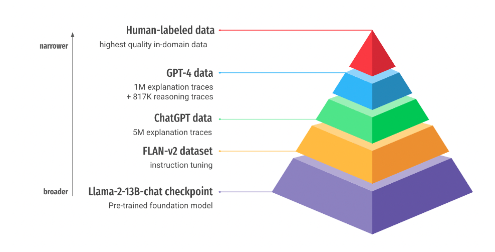 |
| Training strategy      | RLHF/RLAIF/DPO                      | ★★★★              | ★★★★★           | ★★★★★      | RLHF/RLHAIF/DPO, also called "preference tuning" where the model undergoes reinforcement learning to align better to human preferences. This was originally popularized by OpenAI, however it's extremely costly, and seems like a last mile optimization. We have yet to speak with a company who has a critical need for this level of optimization. High-level diagram of [RLHF vs. RLAIF](https://arxiv.org/abs/2309.00267): 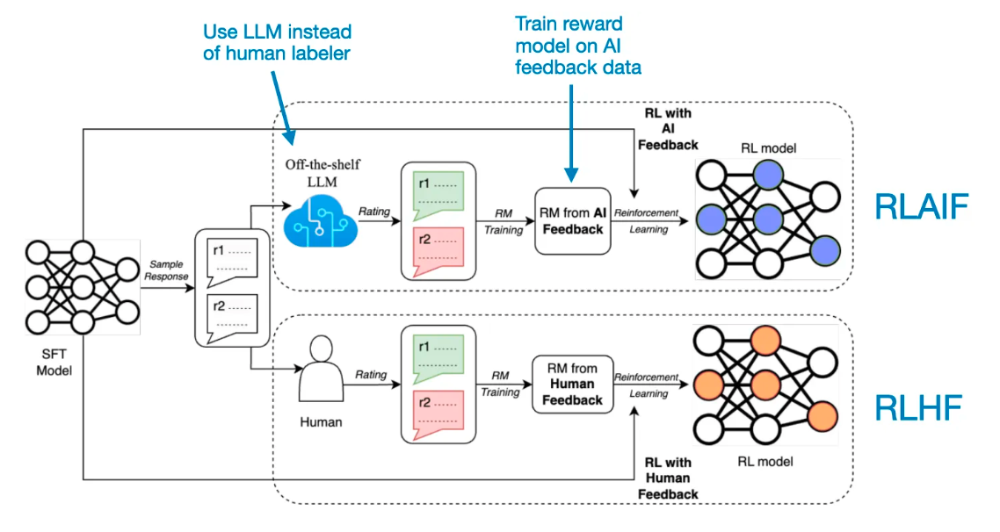                                                                                                                |

### Look at the model's individual mistakes.

***Summary:** While aggregate metrics and advanced automated evaluation methods provide a broad overview of model performance, Manually reviewing examples of your model's outputs brings unparalleled value for a deeper qualitative understanding of model performance.*

Especially in generative contexts where model performance can't be neatly summarized with a clear-cut metric, taking the time to delve into specific examples of where and how your model makes mistakes is not just a step in the evaluation process; it's a critical component of the model development journey.

**Identify Specific Errors:** Only by examining individual examples where the model errs, you can start to categorize and understand the nature of these mistakes. Is the model consistently struggling with certain types of inputs? Are there specific patterns or contexts where errors are more frequent or likely?

**Uncover Data Issues:** Often, patterns in mistakes can be traced back to issues in data preparation or inadequate representation in the training set. Identifying these issues early can save significant resources and time that might otherwise be spent on futile parameter optimization. There's nothing more frustrating or wasteful than to spend hundreds of GPU hours optimizing modeling parameters when you uncover an issue with data quality.

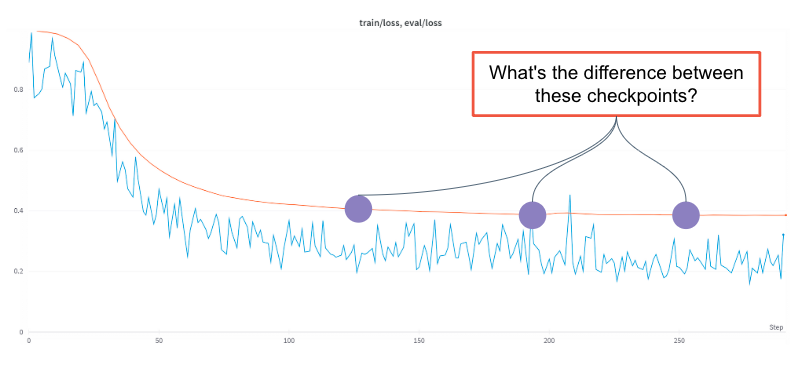

<p align="center" ><i>Loss curves for fine-tuned LLMs will all look like this, yet the qualitative differences between these checkpoints can be substantial.</i></p>

### Monitor your models in production and A/B test them with real users.

***Summary:** While test sets provide a controlled environment for evaluation, the true test of your model’s effectiveness is how it performs with actual users and real-time inputs. Deploy your model and observe its performance in a real-world setting!*

Deploy and monitor your models in production… actually. Whether you are a resesarcher, an engineer, or somewhere in between, there's a lot to learn from going through the due dilligence of productionizing your model for real.

#### Options for model deployment

- **Live Experiment and Gradual Rollout:** Begin by directing a small percentage of traffic (e.g., 1%, then 10%) to the student model. Closely monitor changes in key application metrics like latency and user interactions before scaling up.
- **Dark Launch:** Continue using the teacher model in production but route a portion of traffic to the student model in the background. Compare instances where the student model’s predictions differ from the teacher’s to evaluate its readiness.
- **Hybrid Launch:** If the teacher model outperforms the student model, consider a hybrid deployment. The student model can handle simpler, less resource-intensive queries, while the teacher model addresses more complex requests. This approach balances efficiency with quality.

#### Infrastructure safeguards

- **Monitor Inputs:** Fine-tuned models, being more specialized, can be sensitive to feature drift. 
- **Monitor Outputs:** Establish failsafe mechanisms to scrutinize generated outputs. LLMs in production are often accompanied by rules-based or model-based systems to identify issues and trigger fallbacks. Be aware that using another LLM for output monitoring can add latency.
- **Maintain Logs:** Continue logging the inputs and outputs of your production teacher and student models. These logs are invaluable for future model refinements or re-distillations.

## Contributing

We'd love to hear your feedback!

- If you like the playbook, please [leave a star](https://docs.github.com/en/get-started/exploring-projects-on-github/saving-repositories-with-stars#starring-a-repository)! You can also reach us by pinging the [Ludwig slack](https://ludwig-ai.slack.com/join/shared_invite/zt-mrxo87w6-DlX5~73T2B4v_g6jj0pJcQ) or the [LoRAX Discord](https://discord.gg/CBgdrGnZjy), or finding us on LinkedIn. Testimonials help us justify creating more resources like this.

- If anything seems incorrect, please file an issue to start a discussion. For questions or other messages where an issue isn't appropriate, please open a new discussion topic on GitHub.
- This is a living document. We anticipate making periodic improvements, both small and large. If you’d like to be notified, please watch our repository (see [instructions](https://docs.github.com/en/account-and-profile/managing-subscriptions-and-notifications-on-github/setting-up-notifications/configuring-notifications#configuring-your-watch-settings-for-an-individual-repository)).
- Are there other best practices missing from this list? Feel free to create a PR! We promise to review your suggestions with expediency.
